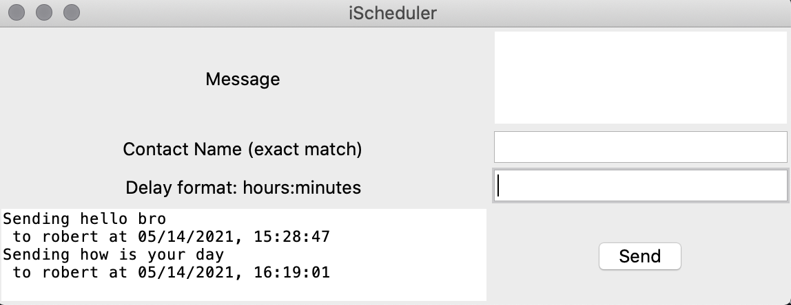

## Overview


This app is designed to help automate and schedule iMessages on Mac OS X ONLY!

It is asynchronous and you can schedule multiple.

Attached in the repo is the iScheduler.app file along with the source to compile it.

This app works by scheduling concurrent to the OS of the form:

`osascript -e "tell application "Messages" to send "{{msg}}" to buddy "{{buddy}}""`


### Requirements
Messages app must be open
Computer must be on (not sleeping!)

UI:



## Compiling

If you would like to compile it yourself do the following, you must have pip installed already.

```
pip install virtualenv
. env/bin/activate
pip install py2app
python setup.py py2app
```

The app requires permission to send messages and will ask to do so on the first message.


Troubleshooting:
If you have multiple python versions amongst your anaconda/miniconda you may have an issue with .dylib files not being found. You want to create a symlink file `libpython3.7.dylib` that points to `libpython3.7m.dylib`. Below is a command demonstrating this:

`ln -s /Users/anthony/miniconda3/lib/libpython3.7m.dylib /Users/anthony/miniconda3/lib/libpython3.7.dylib`

